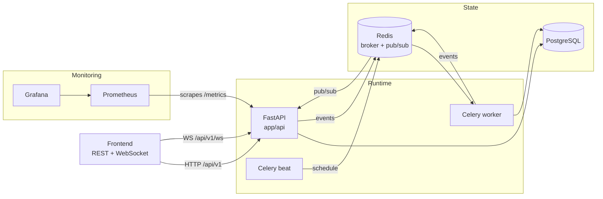

# Architecture

🇬🇧 **English** · [🇷🇺 Русский](ARCHITECTURE.ru.md)

## The big picture



## Layers

```
app/
  api/routes/     HTTP: validation, permissions, commits the transaction
  services/       business logic over a Session, no knowledge of HTTP
  models/         ORM models
  schemas/        Pydantic request/response contracts
  worker/         Celery: jobs.py — logic, tasks.py — session wrappers
  events/         the realtime event bus
  core/           settings, DB, JWT, metrics, logs, timezones
```

The rule is simple: **the route owns the transaction, the service doesn't.**
Services `flush()` but never `commit()`, so the same logic is callable from
an HTTP handler, a Celery task, and a test — each with its own transaction.

## Key decisions

### Caches instead of aggregating on the fly

`CityBuilding`, `DailyProgress`, `Post.likes_count`, `CityScore` are
materialized state, not the source of truth. Summing every `time_entries`
row on every city request doesn't scale once a user has a couple of months
of history. They update the moment a time entry finishes.

The exception is streaks: computed on read, because at the current scale
that's cheaper than another cache to invalidate. When it starts to cost
something, it moves to a background job.

### The leaderboard recomputes lazily

`city_scores` refreshes on read once it's gone stale
(`LEADERBOARD_TTL_SECONDS`). `recompute_scores()` is a plain function, not
an endpoint: a public recompute endpoint would be a ready-made DoS target.
Celery beat can call it on a schedule whenever predictability beats
laziness.

### Events are hints, not data

A realtime event says "re-read this," not "here's the new state." That's
what makes it safe to publish straight from the services: an event that
races a rolled-back transaction costs the client one extra GET, not a wrong
screen. Details in [REALTIME.md](REALTIME.md).

### Notifications are rows, not sends

The `Notification` row in the database is the source of truth; a delivery
channel (WebSocket, later email or push) only announces a row that already
exists. That's why the background jobs are testable with no transport at
all. Details in [NOTIFICATIONS.md](NOTIFICATIONS.md).

### Product config lives in code

Building levels (`app/building_families.py`) and city districts
(`app/city_districts.py`) are product configuration, not user data.
Districts sync into a table only so `district_id` is an honest foreign key;
the sync is idempotent, so code and table can't drift apart.

### City layout is deterministic

A building's district follows from its family; its tile, rotation, and
variant are derived from its own `id`. No layout-algorithm state is stored
anywhere, a city renders identically on every client, and two cities
holding the same buildings still don't look like twins.

### Timezone lives on the user, not the server

Reminders go out at 19:00 **the user's own time**. Beat runs hourly and
picks whoever's local hour matches right now — so no per-user schedule is
needed, and a re-run of the same hour can't double-send.

## Tests

Tests run on an in-memory SQLite: no external services, the whole run takes
seconds. That's a deliberate trade-off — SQLite doesn't catch Postgres
specifics (enum types, concurrent transactions), so migrations are checked
separately against a real Postgres in CI, one revision at a time, because
some bugs only show up on a database that already exists.
