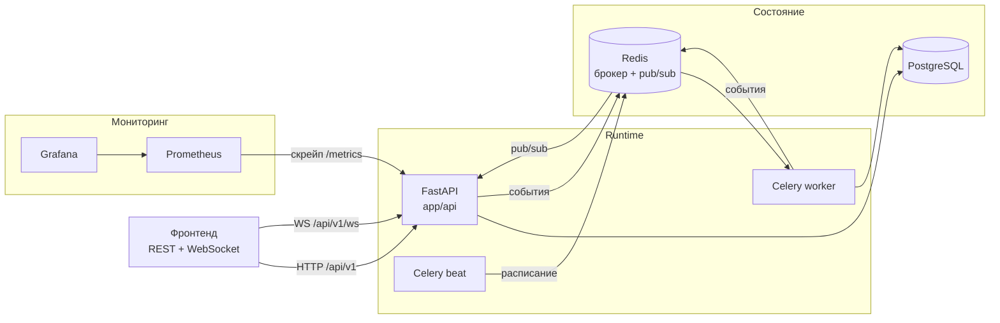

# Архитектура

[🇬🇧 English](ARCHITECTURE.md) · 🇷🇺 **Русский**

## Общая картина



## Слои

```
app/
  api/routes/     HTTP: валидация, права, коммит транзакции
  services/       бизнес-логика поверх Session, без знания об HTTP
  models/         ORM-модели
  schemas/        Pydantic-контракты запросов и ответов
  worker/         Celery: jobs.py — логика, tasks.py — обёртки с сессией
  events/         шина реалтайм-событий
  core/           настройки, БД, JWT, метрики, логи, таймзоны
```

Правило простое: **роут владеет транзакцией, сервис — нет.** Сервисы делают
`flush()`, но не `commit()`, поэтому одну и ту же логику вызывает и HTTP-ручка,
и Celery-задача, и тест — каждый со своей транзакцией.

## Ключевые решения

### Кэши вместо агрегации на лету

`CityBuilding`, `DailyProgress`, `Post.likes_count`, `CityScore` — это
материализованное состояние, а не источник правды. Пересчитывать сумму всех
`time_entries` на каждый запрос города не масштабируется, как только у
пользователя появляется история за пару месяцев. Обновляются в момент, когда
запись времени завершается.

Исключение — стрик: он считается на чтении, потому что при текущих объёмах это
дешевле, чем ещё один кэш, который надо инвалидировать. Когда упрётся —
переедет в фоновую задачу.

### Лидерборд пересчитывается лениво

`city_scores` обновляются на чтении, если протухли (`LEADERBOARD_TTL_SECONDS`).
`recompute_scores()` — обычная функция, а не ручка: публичный эндпоинт
пересчёта был бы готовой точкой для DoS. Celery beat может дёргать её по
расписанию, когда захочется предсказуемости вместо ленивости.

### События — подсказки, а не данные

Реалтайм-событие говорит «перечитай», а не «вот новое состояние». Поэтому
публиковать можно прямо из сервисов: событие, обогнавшее откатившуюся
транзакцию, стоит клиенту одного лишнего GET, а не неверного экрана.
Подробнее — [REALTIME.md](REALTIME.ru.md).

### Уведомления — это строки, а не отправки

`Notification` в БД — источник правды; канал доставки (WebSocket, потом почта
или пуш) лишь объявляет о строке, которая уже есть. Из-за этого фоновые задачи
тестируются вообще без транспорта. Подробнее — [NOTIFICATIONS.md](NOTIFICATIONS.ru.md).

### Продуктовый конфиг живёт в коде

Уровни зданий (`app/building_families.py`) и районы города
(`app/city_districts.py`) — не пользовательские данные, а настройка продукта.
Районы синхронизируются в таблицу только затем, чтобы `district_id` был
честным внешним ключом; синк идемпотентный, поэтому код и таблица не
разъезжаются.

### Раскладка города детерминирована

Район здания следует из семейства, а тайл, поворот и вариант выводятся из его
`id`. Никакого состояния алгоритма раскладки не хранится, город одинаково
выглядит на всех клиентах, и при этом два города с одинаковым набором зданий
не выглядят близнецами.

### Таймзона у пользователя, а не у сервера

Напоминания шлются в 19:00 **по времени пользователя**. Beat запускается
ежечасно и берёт тех, у кого сейчас нужный локальный час — так не нужно
персональное расписание, а повторный запуск часа ничего не дублирует.

## Тесты

Тесты гоняются на SQLite в памяти: никаких внешних сервисов, весь прогон —
секунды. Это осознанный размен: специфику Postgres (enum-типы, конкурентные
транзакции) SQLite не ловит, поэтому миграции отдельно проверяются на реальном
Postgres в CI — по одной ревизии за раз, потому что часть ошибок видна только
на уже существующей базе.
